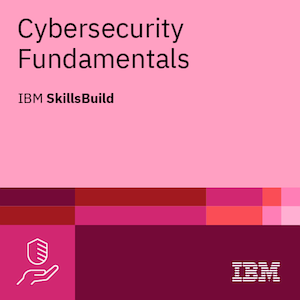
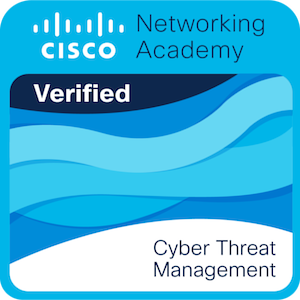
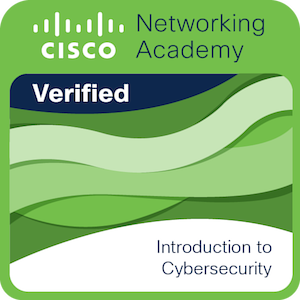
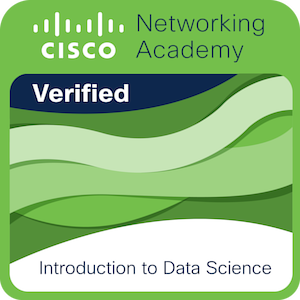
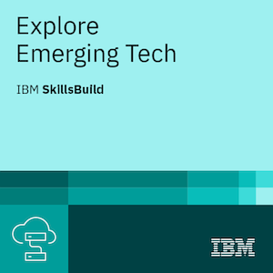
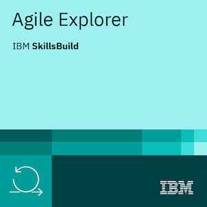

Soy Tecnólogo en **Análisis y Desarrollo de Software**, con especial interés en la **ciberseguridad** y el **ethical hacking**. Pienso de forma analítica, lógica y crítica: investigo cómo funcionan las cosas para entenderlas, no solo para usarlas.

Combino desarrollo de software, Linux, bases de datos y redes con una orientación clara hacia la **seguridad ofensiva y el pentesting**, complementada con una mirada de **gobernanza y gestión de riesgos**. Entender cómo se explota una falla y cómo se previene a nivel organizacional son las dos caras de la misma moneda para mí — los proyectos de abajo son la prueba, no solo teoría.

Actualmente me encuentro desempeñando roles de Líder de Seguridad de la Información y Desarrollador de Software en un proyecto del SENA, liderando la implementación de un MSPI (Modelo de Seguridad y Privacidad de la Información) que abarca los dominios fundamentales de la seguridad de la información: principios de seguridad y gobernanza, gestión de riesgos y cumplimiento normativo, control de acceso, seguridad de redes, continuidad del negocio y respuesta a incidentes, y operaciones de seguridad — complementado con remediaciones técnicas sobre vulnerabilidades OWASP y modelado de amenazas basado en MITRE ATT&CK.

 

## Proyectos destacados

<table>
<tr>
<td width="33%" valign="top">

### [SysMho Hunter](https://github.com/Anderson-029/SysMho_Hunter)
Agente autónomo de pentesting y bug bounty para HackerOne. Cerebro híbrido de decisión en 3 niveles: ML (scikit-learn) → LLM local (Ollama) → cloud (Gemini), enriquecido con RAG (Qdrant) sobre OWASP/PortSwigger. 19 herramientas de recon/explotación integradas.

</td>
<td width="33%" valign="top">

### [SysMho Venom](https://github.com/Anderson-029/SysMho_Venom)
Motor CLI de auditoría de redes en Python (Scapy + iptables): ARP spoofing, sniffing clasificado por protocolo y detección pasiva de sniffers. Evidencia verificable con hash SHA-256, sin base de datos.

</td>
<td width="33%" valign="top">

### [SysMho](https://github.com/Anderson-029/SysMho)
Trading algorítmico en Binance Futures: XGBoost (28 features) + investigación de contexto vía Gemini, sobre 10 activos y múltiples timeframes. Motor de decisión autónomo con CircuitBreaker como red de seguridad de capital.

</td>
</tr>
</table>

 

## Stack de tecnologías

 

## Herramientas de ciberseguridad

`nmap` · `sqlmap` · `nuclei` · `ffuf` · `subfinder` · `amass` · `httpx` · `Burp Suite`

 

## Certificaciones e insignias

<table>
<tr>
<td align="center" width="140">
 
<b>Cybersecurity Fundamentals</b>
</td>
<td align="center" width="140">
 
<b>Cyber Threat Management</b>
</td>
<td align="center" width="140">
 
<b>Intro to Cybersecurity</b>
</td>
</tr>
<tr>
<td align="center" width="140">
 
<b>Intro to Data Science</b>
</td>
<td align="center" width="140">
 
<b>Explore Emerging Tech</b>
</td>
<td align="center" width="140">
 
<b>Agile Explorer</b>
</td>
</tr>
</table>

 

## Contacto

*Responsible disclosure: si encuentras algo, contáctame antes de publicarlo.*

