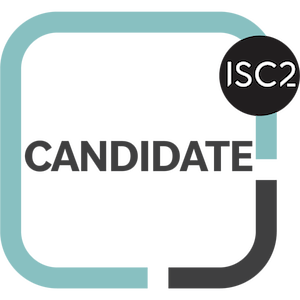

<div align="center">


</div>

<br>

## 🧭 Sobre mí

Desarrollador de software con orientación en ciberseguridad. Con experiencia real en seguridad de la información: políticas, gestión de riesgos, control de acceso y remediación de vulnerabilidades.

Soy autodidacta — la mayor parte de lo que sé lo aprendí construyendo proyectos propios, no solo con cursos. Me muevo en dos frentes:

| | |
|---|---|
| 🎯 **Ofensivo** | Pentesting, red team, hacking ético |
| 📋 **GRC** | Gobernanza, riesgo y cumplimiento normativo |

<br>

## 🛠️ Stack de tecnologías

<table>
<tr>
<td valign="top" width="50%">

**Backend**


</td>
<td valign="top" width="50%">

**Frontend**


</td>
</tr>
<tr>
<td valign="top">

**Infraestructura**


</td>
<td valign="top">

**IA / Machine Learning**


</td>
</tr>
</table>

<br>

## 🔐 Herramientas de ciberseguridad

<div align="center">

`nmap` · `sqlmap` · `nuclei` · `ffuf` · `subfinder` · `amass` · `httpx` · `Burp Suite`

</div>

<br>

## 🏆 Certificaciones e insignias

<div align="center">

<table>
<tr>
<td align="center" width="140">
<br>
<sub><b>ISC² Candidate</b></sub>
</td>
<td align="center" width="140">
<br>
<sub><b>Cybersecurity Fundamentals</b></sub>
</td>
<td align="center" width="140">
<br>
<sub><b>Cyber Threat Management</b></sub>
</td>
<td align="center" width="140">
<br>
<sub><b>Intro to Cybersecurity</b></sub>
</td>
</tr>
<tr>
<td align="center" width="140">
<br>
<sub><b>Intro to Data Science</b></sub>
</td>
<td align="center" width="140">
<br>
<sub><b>Explore Emerging Tech</b></sub>
</td>
<td align="center" width="140">
<br>
<sub><b>Agile Explorer</b></sub>
</td>
<td align="center" width="140"></td>
</tr>
</table>

</div>

**En progreso**

```
[x] ISC²  Certified in Cybersecurity (CC)
[x] ISO/IEC 27001:2022 Fundamentals
[~] Cisco Ethical Hacker
[ ] eJPT
[ ] ISO/IEC 27001 Lead Auditor
[ ] PNPT
[ ] OSCP
```

<br>

## 🚀 Proyectos destacados

<div align="center">

<table>
<tr>
<td width="33%" valign="top">

### 🕵️ SysMho Hunter
Agente autónomo de pentesting y bug bounty. Cerebro híbrido de decisión en 3 niveles: ML (scikit-learn) → LLM local (Ollama) → cloud (Gemini). 19 herramientas de recon/explotación integradas.

</td>
<td width="33%" valign="top">

### 🐍 SysMho Venom
Herramienta de auditoría de redes: ARP spoofing, sniffing y detección de sniffers, con panel web de administración.

</td>
<td width="33%" valign="top">

### 📈 SysMho
Sistema de trading algorítmico con XGBoost, gestión de riesgo y protección de capital como prioridad.

</td>
</tr>
</table>

</div>

<br>

## 📊 Estadísticas

<div align="center">


</div>

<br>

## 📫 Contacto

<div align="center">

[](https://github.com/Anderson-029)

*Responsible disclosure: si encuentras algo, contáctame antes de publicarlo.*

</div>


